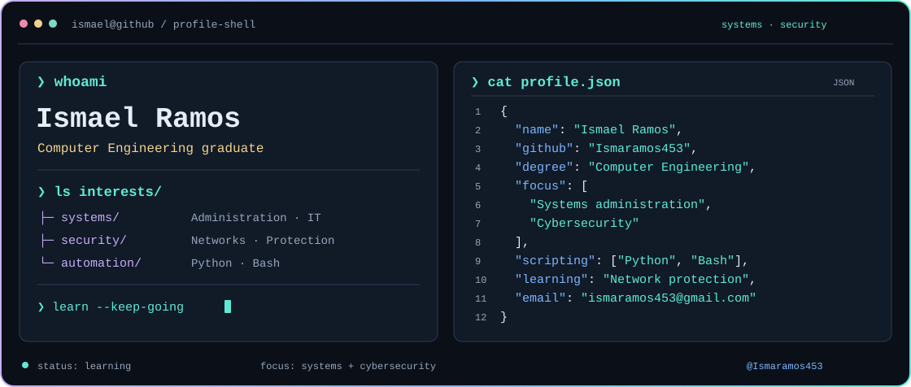

<picture>
  <source media="(prefers-color-scheme: dark)" srcset="assets/banner-dark.svg" />
  <source media="(prefers-color-scheme: light)" srcset="assets/banner-light.svg" />
  
</picture>

## Toolkit

My languages and tools, organized around systems, automation, and development.

<table width="100%">
  <tr>
    <td width="460" align="center" valign="top">
      <h3>Systems &amp; Security</h3>
      
&nbsp;&nbsp;
      &nbsp;&nbsp;
      

      
<strong>Kali Linux &nbsp;·&nbsp; VirtualBox &nbsp;·&nbsp; Networking</strong>

      
Kali Linux, virtual environments, and networks.

    </td>
    <td width="460" align="center" valign="top">
      <h3>Scripting &amp; Automation</h3>
      
&nbsp;&nbsp;
      &nbsp;&nbsp;
      

      
<strong>Python &nbsp;·&nbsp; Bash &nbsp;·&nbsp; Shell Script</strong>

      
Scripts that simplify everyday technical work.

    </td>
  </tr>
  <tr>
    <td width="460" align="center" valign="top">
      <h3>Languages &amp; Data</h3>
      
&nbsp;&nbsp;
      &nbsp;&nbsp;
      

      
<strong>JavaScript &nbsp;·&nbsp; Kotlin &nbsp;·&nbsp; SQL</strong>

      
A programming foundation for security learning.

    </td>
    <td width="460" align="center" valign="top">
      <h3>Application Development</h3>
      
&nbsp;&nbsp;
      

      
<strong>Angular &nbsp;·&nbsp; Android Studio</strong>

      
Web and mobile development background.

    </td>
  </tr>
  <tr>
    <td width="460" align="center" valign="top">
      <h3>Version Control</h3>
      

      
<strong>Git</strong>

      
Managing changes and collaborating on code.

    </td>
    <td width="460" align="center" valign="top">
      <h3>Planning &amp; Design</h3>
      
&nbsp;&nbsp;
      

      
<strong>Trello &nbsp;·&nbsp; Figma</strong>

      
Organizing projects and communicating ideas.

    </td>
  </tr>
</table>

## GitHub Activity

  <a href="https://github.com/Ismaramos453">
    <picture>
      <source media="(prefers-color-scheme: dark)" srcset="https://github-stats-extended.vercel.app/api?username=Ismaramos453&amp;bg_color=080F1E&amp;title_color=60A5FA&amp;text_color=9BAFCA&amp;icon_color=5EEAD4&amp;border_color=233956&amp;border_radius=14&amp;card_width=460&amp;disable_animations=true&amp;show_icons=true&amp;hide_rank=true&amp;custom_title=GitHub%20overview" />
      <source media="(prefers-color-scheme: light)" srcset="https://github-stats-extended.vercel.app/api?username=Ismaramos453&amp;bg_color=EEF5FC&amp;title_color=2563EB&amp;text_color=4D6480&amp;icon_color=087F72&amp;border_color=C7D8EB&amp;border_radius=14&amp;card_width=460&amp;disable_animations=true&amp;show_icons=true&amp;hide_rank=true&amp;custom_title=GitHub%20overview" />
      
    </picture>
  </a>
  <a href="https://github.com/Ismaramos453">
    <picture>
      <source media="(prefers-color-scheme: dark)" srcset="https://github-stats-extended.vercel.app/api/top-langs/?username=Ismaramos453&amp;bg_color=080F1E&amp;title_color=60A5FA&amp;text_color=9BAFCA&amp;icon_color=5EEAD4&amp;border_color=233956&amp;border_radius=14&amp;card_width=460&amp;disable_animations=true&amp;layout=compact&amp;langs_count=6&amp;custom_title=Most%20used%20languages" />
      <source media="(prefers-color-scheme: light)" srcset="https://github-stats-extended.vercel.app/api/top-langs/?username=Ismaramos453&amp;bg_color=EEF5FC&amp;title_color=2563EB&amp;text_color=4D6480&amp;icon_color=087F72&amp;border_color=C7D8EB&amp;border_radius=14&amp;card_width=460&amp;disable_animations=true&amp;layout=compact&amp;langs_count=6&amp;custom_title=Most%20used%20languages" />
      
    </picture>
  </a>

  <a href="https://github.com/Ismaramos453">
    <picture>
      <source media="(prefers-color-scheme: dark)" srcset="https://streak-stats.demolab.com/?user=Ismaramos453&amp;background=080F1E&amp;border=233956&amp;stroke=233956&amp;ring=5EEAD4&amp;fire=60A5FA&amp;currStreakNum=60A5FA&amp;sideNums=60A5FA&amp;currStreakLabel=5EEAD4&amp;sideLabels=9BAFCA&amp;dates=9BAFCA&amp;border_radius=14&amp;timezone=Atlantic%2FCanary&amp;disable_animations=true" />
      <source media="(prefers-color-scheme: light)" srcset="https://streak-stats.demolab.com/?user=Ismaramos453&amp;background=EEF5FC&amp;border=C7D8EB&amp;stroke=C7D8EB&amp;ring=087F72&amp;fire=2563EB&amp;currStreakNum=2563EB&amp;sideNums=2563EB&amp;currStreakLabel=087F72&amp;sideLabels=4D6480&amp;dates=4D6480&amp;border_radius=14&amp;timezone=Atlantic%2FCanary&amp;disable_animations=true" />
      
    </picture>
  </a>

<!-- Dynamic cards provided by GitHub Stats Extended, GitHub Readme Streak Stats,
     and GitHub Readme Activity Graph. Availability depends on those services.
     https://github.com/stats-organization/github-stats-extended
     https://github.com/DenverCoder1/github-readme-streak-stats
     https://github.com/Ashutosh00710/github-readme-activity-graph -->

  
  &nbsp;
  

## Connect

  
  &nbsp;
  
  &nbsp;
  

<!-- Brand tiles: Skill Icons (https://github.com/tandpfun/skill-icons), MIT license.
     Local pictograms: VirtualBox, Networking, SQL, Shell Script, and Trello.
     Statistics remain live embeds from the providers credited above. -->
